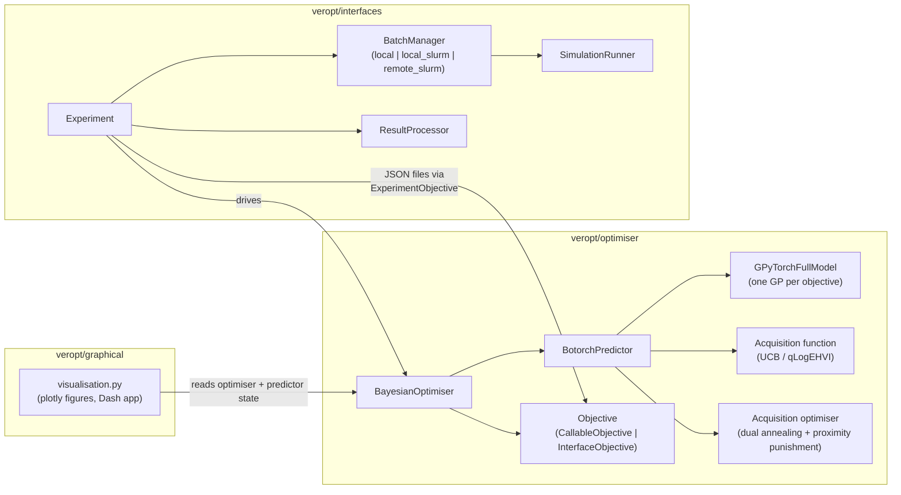
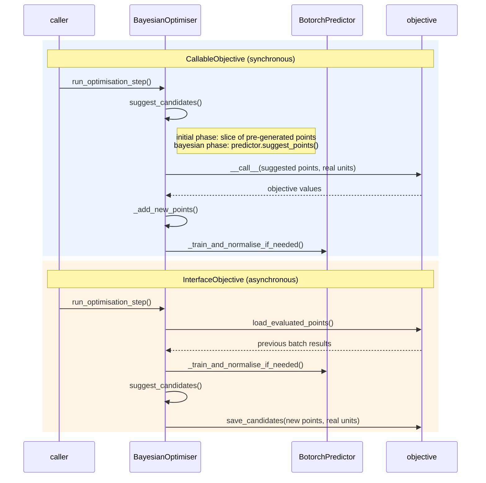
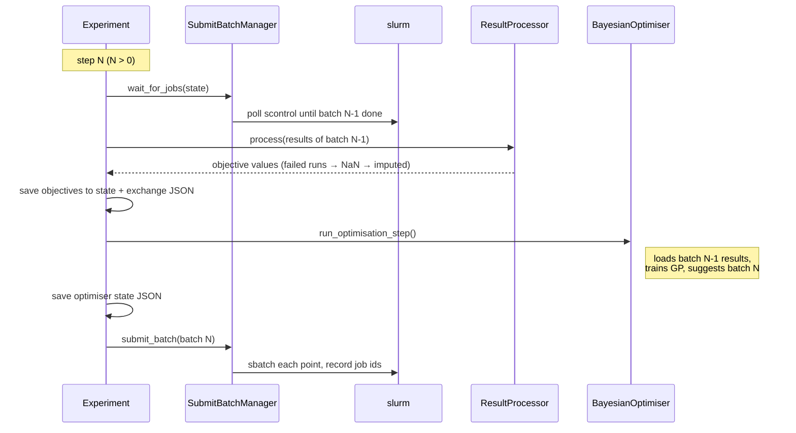

# Architecture

veropt is a Bayesian optimisation library for expensive black-box problems (~100 evaluations),
originally built to tune the [VEROS](https://veros.readthedocs.io/) ocean simulator. It is split
into three layers with a deliberately narrow seam between them:

- **`veropt/optimiser`** is the mathematical core (torch/gpytorch/botorch). It knows nothing about
  simulations, slurm, or plotting. See [optimiser.md](optimiser.md).
- **`veropt/interfaces`** runs expensive simulations as objectives, locally or on a cluster, with
  resumable on-disk state. It talks to the core *only* through the two-method
  `InterfaceObjective` contract. See [interfaces.md](interfaces.md).
- **`veropt/graphical`** renders plotly figures by reading the optimiser's public properties and
  the predictor's prediction methods. See [graphical.md](graphical.md).

Entry points users actually call:

- `veropt.bayesian_optimiser(...)` (`optimiser/constructors.py`) — build an optimiser.
- `veropt.interfaces.constructors.experiment(...)` — build a resumable simulation experiment.
- `veropt.graphical.visualisation.*` — plot it.
- `veropt.save_to_json` / `load_optimiser_from_state` / `load_optimiser_from_settings` — persistence.

## The two objective flavours

Everything pivots on which kind of objective the optimiser holds (`optimiser/objective.py`):

| | `CallableObjective` | `InterfaceObjective` |
|---|---|---|
| What it is | A Python function (`_run()`) | A two-method contract: `save_candidates()` / `load_evaluated_points()` |
| Step style | Synchronous | Asynchronous (an external process evaluates the points between optimiser steps) |
| Used by | Practice objectives, user functions | `veropt/interfaces` (`ExperimentObjective` writes/reads JSON exchange files) |

## One optimisation step

`BayesianOptimiser.run_optimisation_step()` (`optimiser/optimiser.py`). Note the inverted order in
the interface case — results of the *previous* batch are loaded first, then new candidates are
suggested and handed off:

The optimiser is in **initial mode** while `n_points_evaluated < n_initial_points` (serving slices
of pre-generated random points) and switches to **bayesian mode** afterwards (the
`optimisation_mode` property). The GP is first trained once
`n_points_evaluated >= settings.n_points_before_fitting`; before that, suggested points carry no
prediction.

## One experiment step (submitted/slurm mode)

`Experiment.run_experiment_step_submitted()` (`interfaces/experiment.py`) interleaves the
optimiser with slurm so that exactly one batch is in flight at a time:

Direct mode (`run_experiment_step_direct()`, `experiment_mode == "local"`) is the simple
synchronous version: suggest → run each simulation blocking → process → feed back, all in one call.

Every step persists the full experiment state (`ExperimentalState` JSON + optimiser state JSON),
which is what makes `experiment(..., continue_if_possible=True)` able to resume after a crash,
requeue, or login-node logout.

## Cross-cutting mechanisms

- **Dual-unit data.** The optimiser stores variables/objectives in real units and serves
  normalised views once normalisers are fitted (default: zero mean, unit variance per dimension).
  Tensors cross internal API boundaries wrapped in `TensorWithNormalisationFlag`; attributes use a
  `_real_units` suffix. Multi-objective runs renormalise every step by default, single-objective
  runs don't.
- **Persistence.** Every savable component subclasses `SavableClass`
  (`optimiser/saver_loader_utility.py`): it serialises via `gather_dicts_to_save()` and is
  reconstructed by `rehydrate_object()`, which dispatches on a unique `name` class attribute.
  See [extending.md](extending.md) — forgetting the `name` is the classic mistake.
- **NaN handling.** The core cannot ingest NaNs yet, so `interfaces/experiment.py:_mask_nans()`
  imputes failed simulations with `nanmin − 2·nanstd` of the objective so far (a pessimistic but
  finite value).
