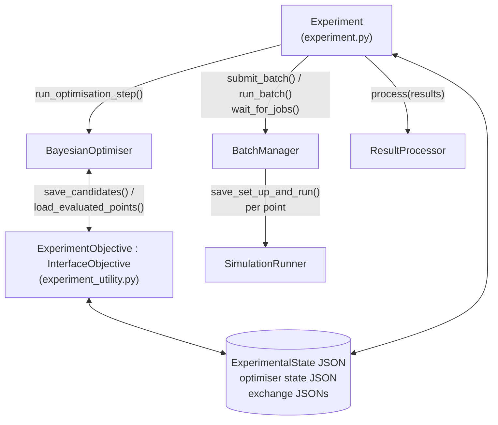

# `veropt/interfaces` — simulations as objectives

This subpackage runs expensive simulations (e.g. VEROS) as optimisation objectives — locally or
through slurm — with all state checkpointed to disk so experiments survive crashes and can be
resumed. It depends on the core only through `InterfaceObjective`.

## Cast of characters



- **`Experiment`** orchestrates; built by `constructors.experiment(...)`.
- **`BatchManager`** (`batch_manager.py`) executes one batch of candidate points.
- **`SimulationRunner`** (`simulation.py` + `local_simulation.py` / `slurm_simulation.py`) sets up
  and launches one simulation.
- **`ResultProcessor`** (`result_processing.py`) turns finished simulations into objective values.
- **`ExperimentObjective`** implements the optimiser-facing contract by reading/writing two JSON
  exchange files.

## Execution modes

`ExperimentMode` (`experiment_utility.py`): `local`, `local_slurm`, `remote_slurm`.

| | direct (`local`) | submitted (`local_slurm`, `remote_slurm`) |
|---|---|---|
| Batch manager | `LocalBatchManager` (`DirectBatchManager`) | `LocalSlurmBatchManager` / `RemoteSlurmBatchManager` (`SubmitBatchManager`) |
| Step method | `run_experiment_step_direct()` | `run_experiment_step_submitted()` |
| Behaviour | suggest → run each simulation blocking, sequentially → process → feed back | wait for *previous* batch (poll `scontrol`) → process it → optimiser step (ingest + suggest) → `sbatch` the new batch |
| In flight | nothing between steps | exactly one batch between steps |

`RemoteSlurmBatchManager` is currently a stub (`NotImplementedError`).

The submitted-mode sequence diagram is in [architecture.md](architecture.md). Two wrinkles:

- On step 0 (or right after a version rebuild, the `just_rebuilt` flag) there is no previous batch
  to wait for; the step goes straight to suggest-and-submit.
- The optimiser state is saved (`_save_optimiser()`) every submitted step, after ingesting results.

## Slurm specifics (`LocalSlurmBatchManager`, `slurm_simulation.py`)

- `submit_batch()` → per point: set up the point directory, render the batch script from
  `slurm/veros_batch_script_template.sh` (plain `{variable}` substitution: partition, cores,
  cycles, filenames, …), run `sbatch --parsable`, parse the job id from stdout, record it in the
  state.
- `wait_for_jobs()` → polls `scontrol show job <id>` for all pending jobs every
  `check_job_status_frequency` seconds until the batch is done, updating each `Point.state`.
- The VEROS template uses `veros resubmit` with a `--callback 'sbatch …'` so long runs re-queue
  themselves in cycles.
- `SlurmVerosRunner.try_to_run()` retries submission up to `max_tries` times.

## Simulation runners

`SimulationRunner.save_set_up_and_run()` is a template method: write
`<simulation_id>_parameters.json`, then call the subclass's `set_up_and_run()`, which returns a
`SimulationResult` (pydantic: simulation id, parameters, output directory/filename, stdout/stderr
files, return code, slurm log).

The VEROS runners (`LocalVerosRunner` / `SlurmVerosRunner`) work by **editing the run script**:
`veros_utility.edit_veros_run_script()` regex-replaces `settings.<name> = …` lines in the copied
setup script with the candidate parameter values (keeping the original as a comment). Local runs
execute `veros run …` inside a conda or venv environment (`VirtualEnvironmentManager`); slurm runs
go through the batch script. `MockSimulationRunner` (`local_simulation.py`) supports tests.

## Result processing

`ResultProcessor.process(results, existing_objective_values)`:

- if a point already has objective values in the state, they are reused (no recomputation);
- a result with nonzero return code, or whose output file fails to open, yields **NaN**;
- otherwise `calculate_objectives(result)` (subclass hook) computes `{objective_name: value}`.

NaNs are then imputed in `experiment.py:_mask_nans()` with `nanmin − 2·nanstd` per objective
(the core cannot ingest NaNs yet). `TestVerosResultProcessor` is the reference implementation:
opens `<output>.overturning.nc` with xarray and reads AMOC strength at depth.

## Configuration

`constructors.experiment(simulation_runner, result_processor, experiment_config, optimiser_config,
batch_manager_class=None, continue_if_possible=False)` takes two JSON files
(examples in `veropt/interfaces/configs/`):

- **experiment config** (`ExperimentConfig`, pydantic): experiment name/version, parameter names
  and bounds, `experiment_mode`, paths (experiment dir, run script, output filename).
- **optimiser config**: the settings JSON consumed by `load_optimiser_from_settings` —
  i.e. the `bayesian_optimiser(...)` arguments minus the objective.

The runner has its own config (`LocalVerosConfig` / `SlurmVerosConfig`): environment manager,
backend (numpy/jax), device, float type, and for slurm the partition/cores/cycles plus the path to
the batch script template.

## On-disk layout and resuming

`PathManager` (`experiment_utility.py`) fixes the layout (name `exp`, version `v1`):

```
<path_to_experiment>/exp/
├── exp_v1_experimental_state.json      # ExperimentalState: every Point (parameters, state,
│                                       #   slurm job id, SimulationResult, objective values)
├── exp_v1_optimiser_state.json         # full optimiser save (save_to_json)
└── results/
    ├── exp_v1_suggested_parameters.json    # optimiser → experiment exchange file
    ├── exp_v1_evaluated_objectives.json    # experiment → optimiser exchange file
    └── point_<N>_v1/                       # one directory per evaluation
        ├── <run script>.py                 # copied setup, parameters edited in
        ├── point_<N>_v1_parameters.json
        ├── point_<N>_v1.out / .err         # submission stdout/stderr
        ├── veros_batch_point_<N>_v1.sh     # slurm only
        ├── slurm_point_<N>_v1.out          # slurm log
        └── <output>.…nc                    # simulation output
```

`Experiment` construction paths:

- `from_the_beginning()` — fresh state.
- `continue_if_possible()` — resume from `*_experimental_state.json` if present, else fresh.
  This is what `experiment(..., continue_if_possible=True)` uses.
- `continue_with_new_version()` (via `constructors.experiment_with_new_version()`) — reuse an
  existing experiment's evaluated points under a new version/config (e.g. a new objective):
  re-processes existing results, replays them into a fresh optimiser
  (`re_run_experiment_step_from_existing_data()`), and sets `just_rebuilt` so the next submitted
  step skips the wait.

`current_step` is derived, not stored: `n_points_submitted // n_evaluations_per_step`, so resuming
recomputes its position from the state file alone.
